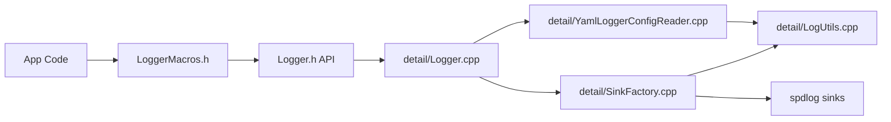
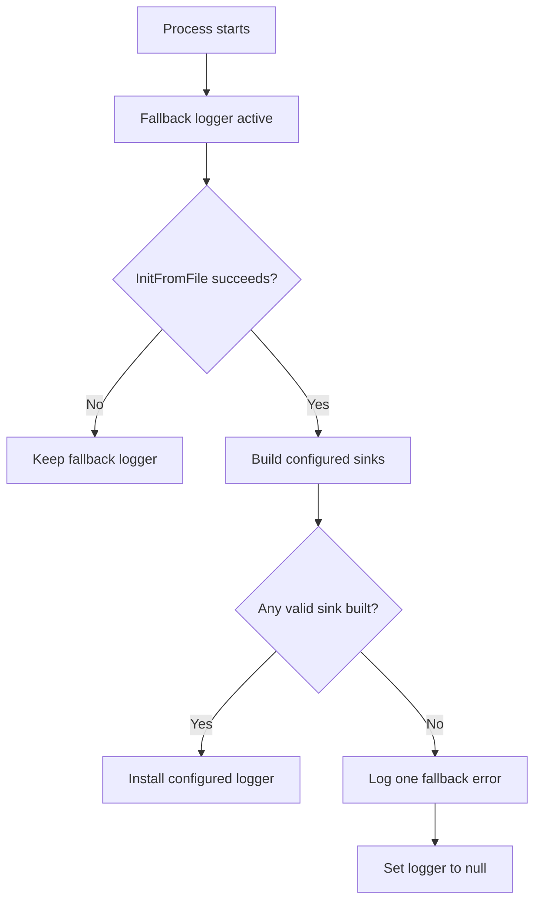

# LOGGER

## Purpose
This module provides application logging with:
- immediate startup logging (before config init)
- YAML-based sink configuration
- hidden spdlog details behind a small public API
- optional custom sinks

## Public Surface
Files at the Logging root are public:
- Logger.h
- LoggerMacros.h
- SinkConfig.h

Public API (from Logger.h):
- RegisterCustomSinkFactory(name, factory)
- InitFromFile(configPath, errorMessage)
- Flush()
- LogDebug(message)
- LogInfo(message)
- LogError(message)
- LogCrit(message)
- IsInitialized()

Macros (from LoggerMacros.h):
- GPDEBUG(...)
- GPINFO(...)
- GPERROR(...)
- GPCRIT(...)

## Internal Structure
All implementation units live under Logging/detail.

## YAML Config
Top-level keys:
- level: string (for example: debug, info, warn)
- pattern: spdlog pattern string
- sinks: array

Per-sink keys:
- type: console | rotating_file | custom
- level: string
- colored: bool (console only)
- path: string (rotating_file)
- max_file_size_bytes: number (rotating_file)
- max_files: number (rotating_file)
- name: string (custom)
- plus any custom sink fields (passed through via yamlNode)

## Behavior Rules
- Startup default (before config): fallback logger is active.
- Fallback logger is always uncolored.
- After successful InitFromFile:
  - only configured sinks are used
  - no implicit console sink is added
- If config loads but zero valid sinks are built:
  - one error is written with fallback logger
  - logger is set to null
  - logging then becomes a silent no-op
- If config file fails to load:
  - fallback logger remains active
  - InitFromFile returns false and sets error text

## Design Notes
- The Logging target prefers spdlog header-only linkage when available.
- spdlog types are not exposed to normal users of this module.
- Sink levels use canonical level strings centralized in detail/LogUtils.
